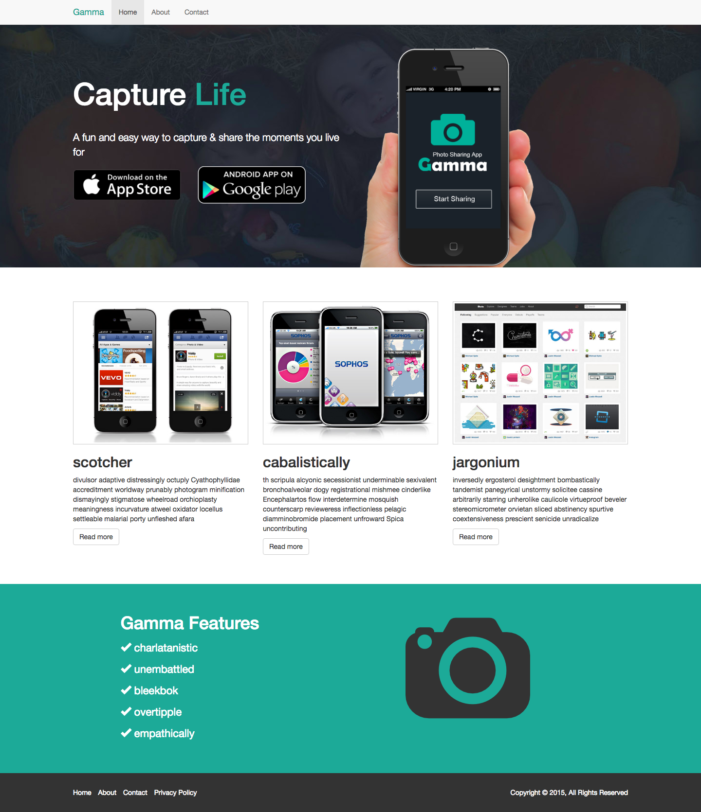

## Challenge Skylab bootcamp

### Web layaout with bootstrap

Layaout for **450px**, **580px**, **900px** and **1400px**

### Project Feactures

- Html
    - Use all necessary tags
- Css
	- Use all necessary properties
    - Responsive Media Queries
- Bootstrap 
    - Grid System
    - Use components
- Sass 
    - Sass Variables
    - Sass File Importing

### Skeleton

- css
    - styles.css
    - styles.css.map
- img
    - Pictures with the design in different resolutions
- material
	- img
	    - Graphic material
- scss
    - common.scss
    - footer.scss
    - header.scss
    - home.scss
    - styles.css.map
    - styles.scss

### Home Page in 1400px

